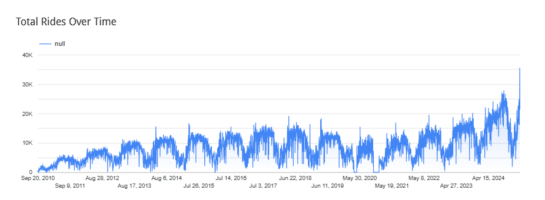

# Optimizing Urban Mobility: A Data Pipeline for Capital Bikeshare Trip & Membership Analysis

## Project Overview
This project builds a complete data engineering pipeline to analyze and optimize bike-sharing operations in Washington DC using Capital Bikeshare trip data. The system ingests, processes, and analyzes bike trip records to uncover usage patterns, fleet performance, and member behavior to support operational decisions and member engagement strategies.

## Problem Being Solved
**Capital Bikeshare** must balance bike availability, station demand, and user satisfaction. However, without efficient data processing, it’s difficult to:
1. Understand trip duration trends.
2. Identify high-demand stations.
3. Track how members vs. casual riders use the system.
4. Improve bike fleet utilization.

## 📌 Project Objective
The primary objective of this project is to build an end-to-end Data Engineering pipeline for analyzing bike-sharing data, leveraging modern cloud and open-source tools. The goal is to efficiently ingest, process, store, and visualize bike trip data to uncover valuable insights about station performance, user behavior, and operational patterns.

✅ Technical Objectives:
1. Infrastructure Deployment using **Terraform**
- Provision and manage cloud resources on Google Cloud Platform (GCP) in an automated, scalable, and reproducible manner using Terraform.

Data Ingestion using Kestra

Implement a workflow orchestration system with Kestra to automate the ingestion of bike-share data from public sources into a Google Cloud Storage (GCS) bucket.

Data Processing with Apache Spark

Utilize Apache Spark for batch processing of the ingested data.

Perform data transformations and combine multiple raw datasets using Spark SQL.

Save the processed and cleaned data as Parquet files into the designated GCS bucket for further analytics.

Data Warehousing with BigQuery

Load the processed Parquet files from the GCS bucket into Google BigQuery.

Create partitioned and clustered tables for optimized query performance.

Design and run SQL queries to derive business insights such as station demand trends, member vs. casual usage patterns, and trip distance analytics.

Data Visualization with Looker Studio

Connect Looker Studio to the BigQuery data warehouse.

Develop an interactive and visually appealing dashboard to present key metrics and insights including:

Total rides over time

Peak usage hours and days

Station utilization analysis

Membership type behavior comparison

Trip distance and duration distribution

Popular routes and geo-mapped station activity

